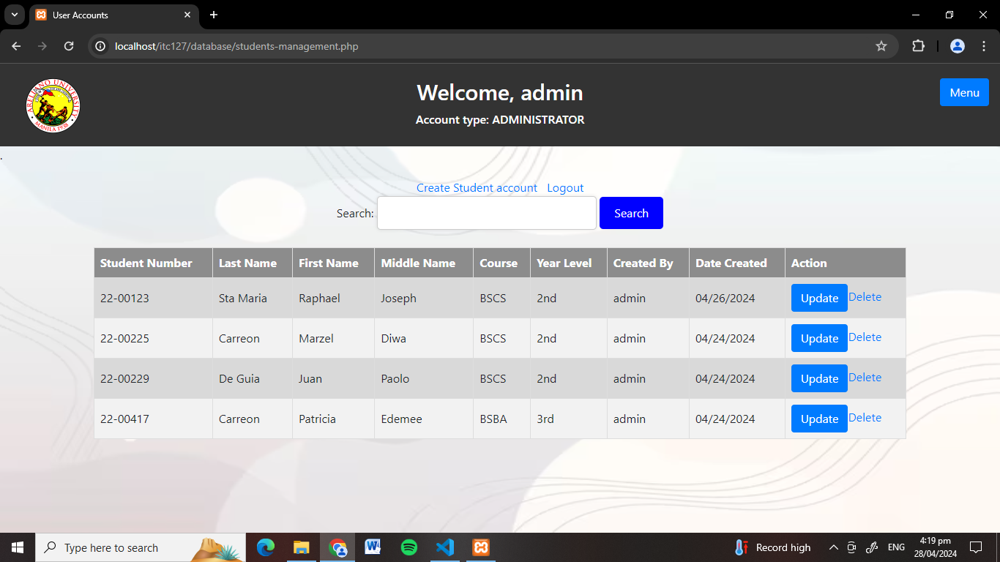

# Arellano Student Grade Database (First Project)
A database system built for Arellano University that manages student grades. It's a web-based CRUD app that includes modals, user roles, and multiple management systems.

> ⚠️ This is one of my early projects. The code may not be perfect, but it reflects how I started learning full-stack development.

## 🛠️ Features
- 👤 **Account Management** – Add, edit, and delete user accounts
- 🎓 **Student Management** – Register students and auto-generate login accounts
- 📚 **Subject Management** – Add subjects based on the student's course
- 📝 **Grade Management** – Input, view, and update student grades
- 🔒 **User Roles** – Admin has full access, students can only view their grades
- 💬 **Modal Usage** – All forms and updates are done using modals for a smoother UX

## 🧠 What I Learned
- How to use **modals** for smooth data entry and edits
- Implementing **CRUD operations** across multiple systems
- Automatically creating user accounts when adding a student
- Showing different views and access levels based on **user roles**
- Connecting subjects dynamically based on the student’s course

## 🖼️ Screenshots
**Login Page**

**Management System**

